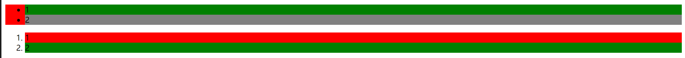
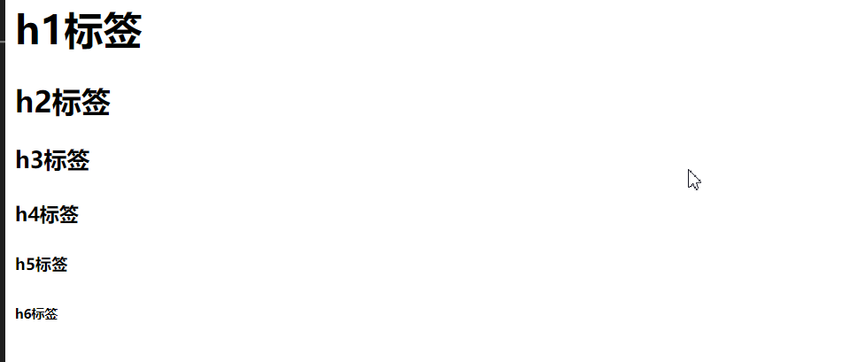
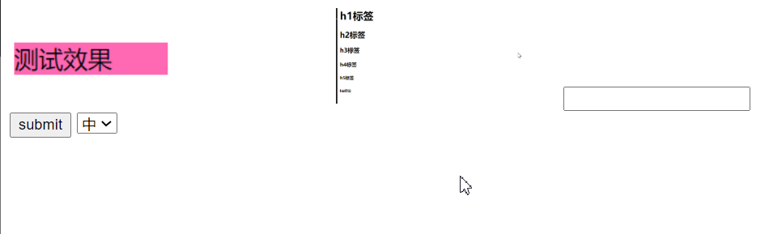
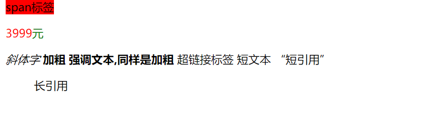
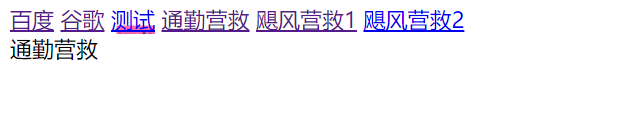
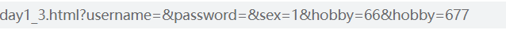

# vue-day1

学一个东西首先得知道为什么学它, 知道它能干什么, 以及它的发展前景
然后是打基础, 然后才能开始深入学习

## 早上

1. 介绍了html5
2. 行业优势
3. 未来发展


## 下午

单标签

```html
<meta charset="utf-8"/> <!-- 防止代码乱码-->

<!-- 标签-> 标记(html) 元素(css) 节点(js)-->
<!--
按功能分

1. 块级标签 display:block;
2. 内联块标签 display:inline-block
3. 内联标签 display:inline
-->
```


### 块级标签

1. 默认宽度为父级标签的宽度

2. 默认排列顺序为竖着排
3. 可以直接通过宽高改变大小
4. 默认自适应内容高度

分区标签
将页面划分为一个个可视可操作区域

```html
    <div style="background-color: chartreuse; height: 100px; width: 10%;"></div>
    <div style="background-color: chocolate ; width: 10%; height: 100px;"></div>
```

浏览器效果


无序列表与有序列表

```
    <ul style="background-color: red;">
        <!--行或列-->
        <li style="background-color: green;"> 1</li>
        <li style="background-color: gray;">2</li>
    </ul>
    <ol>
        <li style="background-color: red;">1</li>
        <li style="background-color: green;">2</li>
    </ol>
```




段落标签

```
    <p style="background-color: hotpink; width: 100px;">测试效果</p>
```


标题标签,一个网页最多只有一个h1

```
    <h1>h1标签</h1>
    <h2>h2标签</h2>
    <h3>h3标签</h3>
    <h4>h4标签</h4>
    <h5>h5标签</h5>
    <h6>h6标签</h6>
```




### 内联块标签

特点

1. 默认排列方式 横着排
2. 默认大小为内容的大小 无内容则为0
3. 可以通过宽高改变大小


```html
    
    
    <input type="text" name="" id="" value="" />
    <button>submit</button>
    <select>
        <option value="1">中</option>
        <option value="2">美</option>
        <option value="3">英</option>
        <option value="4">法</option>
    </select>
```



横着排,当大小超过会才会还下一行


内联元素

举例: 3999元, 我分为3999跟元两个元素,元标绿色,3999标红色

特点

1. 默认排列方式 横着排
2. 不能直接通过宽高改变大小
3. 自适应内容大小


```html
    <span style="background-color: red; width: 100px; height: 100px;">span标签</span>
    <p style="color: red;">3999<span style="color: green;">元</span></p>
    
    <!--常见内联标签-->
    <i>斜体字</i>
    <b>加粗</b>
    <strong>强调文本,同样是加粗</strong>
    <a>超链接标签</a>
    <label>短文本</label>
    <q>短引用</q>
```



a标签 当前页面跳转和新页面跳转

```html
    <a href="http://www.baidu.com" target="_blank">百度</a>
    <a href="http://www.google.com" target="_self">谷歌</a>
    
```


瞄点

```html
    <a href="#a1">通勤营救</a>
    <a href="#a2">飓风营救1</a>
    <a href="#a3">飓风营救2</a>
    <div id="a1" style="height: 2000px;">通勤营救</div>
    <div id="a2" style="height: 2000px;">飓风营救1</div>
    <div id="a3" style="height: 2000px;">飓风营救2</div>
```

可以直接通过id寻到div处

设置背景图片

```html
 <a href="测试" style="background-image: url(imgs/image-20200601145814038.png);">测试</a>
```





点击百度,新页面打开百度

点击谷歌,当前页打开谷歌

点击通勤营救, 直接跳到通勤营救处

点击测试 , 就崩了啊


### 表单

1. 单选框通过指定value可以控制传的值,默认传为on
2. 默认选中只要有checked属性就行, 而不需要指定值
3. 通过form表单提交的话,要有name属性,没带name属性的不会传
4. 复选框传参没做好可能有参数污染

```html
    <form action="day1_3.html" method="get" name="login">
        用户名: <input type="text" name="username" placeholder="请输入用户名"/>
        <br/>
        密码: <input type="password" name="password" placeholder="请输入密码"/>
        <br/>
        性别: <input type="radio" name="sex" checked value="1" />男<input type="radio" name="sex" value="0"/>女
        <br/>
        爱好:<input type="checkbox"/>打篮球<input type="checkbox"/>打羽毛球
        <br/>
        <input value="提交" type="submit"/>
        <input value="reset" type="reset"/>
    </form>
```

复选框这里传了两个hobby




## 总结

