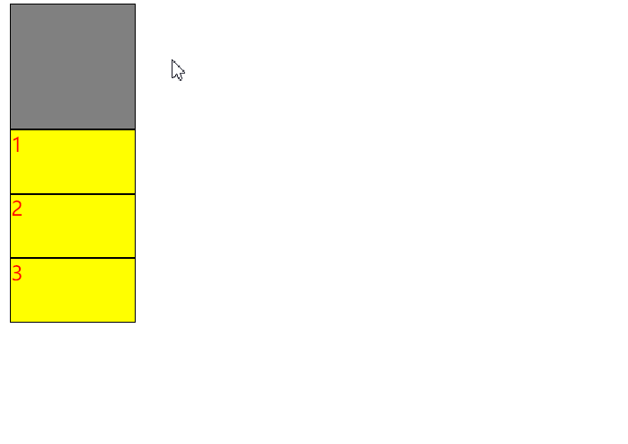
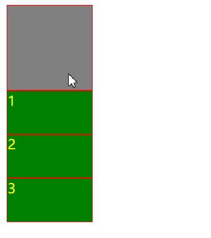
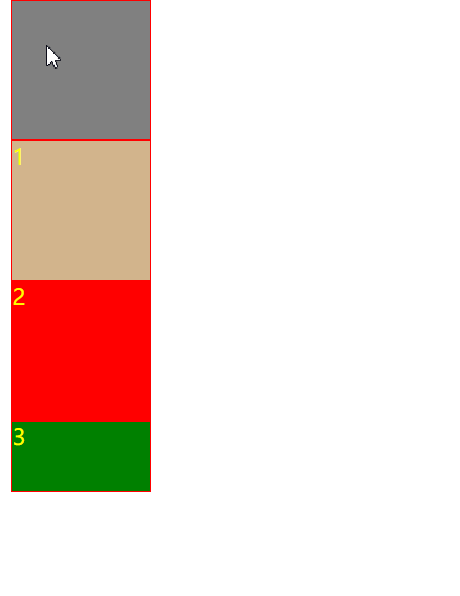
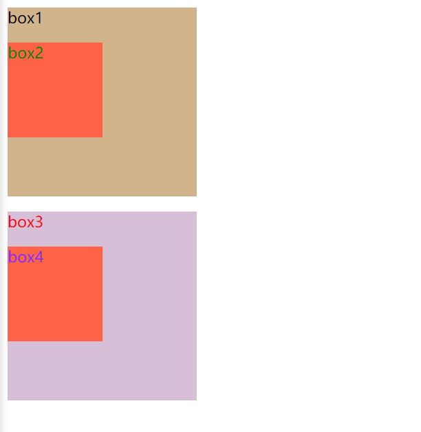
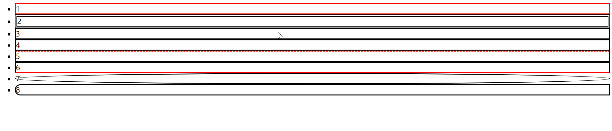

# day-2


## 早上

首先讲解昨天的遗留问题

讲css

1. 内联样式表 style属性

   ```css
   <div style="width: 100px;"></div>
   ```

2. 内部样式表

   ```css
   <style> div{width: 100px}</style>
   ```

3. 外部样式表

   ```css
   <link href="css/style.css"/>
   ```


css语法组成 选择器(选择符) 声明(属性和属性值)

- 选择器 就是把标签取出来给其设置样式
- 属性与属性值  属性:属性值;

```css
.layui-item{
	width: 100px;
    height: 200px;
}
```

样式优先级问题,

1. 内联样式表 > 选择器
2. 其余看声明顺序, 靠后的实现
3. !important可以提高优先级

```html
<!DOCTYPE html>
<html lang="en">
<head>
    <meta charset="UTF-8">
    <meta name="viewport" content="width=device-width, initial-scale=1.0">
    <title>css</title>
    
    <style type="text/css">
        div{
            color: red;
            height: 50px;
            width: 100px;
            border: 1px solid black;
            background-color: yellow;
        }

        p{
            color: yellow;
        }
    </style>
    <link href="./static/css/style.css" rel="stylesheet" type="text/css"/>
</head>
<body>
    <div style="height: 100px; background-color: gray;"></div>
    <div>1</div>
    <div>2</div>
    <div>3</div>
</body>
</html>
```

外部样式表文件

```css
div{
    color: yellow;
    height: 50px;
    width: 100px;
    border: 1px solid red;
    background-color: green;
}
```

这是内部在后的结果



这是外部样式表在后的结果



选择器

标签选择器

```css
div{
	color: red;
}
```

群组选择器

```css
div,p{
	
}
```

id选择器

```css
#box1{
    width: 100px;
    height: 100px;
    background-color: tan;
}

#box2{
    width: 100px;
    height: 100px;
    background-color: red;
}


```



类型选择器

```css
.box{
    width: 100px;
    height: 100px;
    background-color: turquoise;
}
```

通配选择器

```css
*{

}
```

子代选择器

```
.box3 > p{
	color: red;
}
```

交集选择器, 并集选择器

```
div.box2{
    color: green;
}
div .box4{
    color:blueviolet;
}
```

这个在这里效果一样是因为继承的原因, div.box2是div并且class="box2"

div .box4是 div或者是class="box4"




## 下午


伪类选择器,当时做的笔记

- a:link  没访问过
- a:visted 访问过
- a:hover 鼠标划过
- a:active 正在点击
- input:focus 获取焦点
- p::selection 为p标签中选中内容使用样式
- p::-moz-selection 专门用于火狐


快捷补全

```html
<!--ul>li*8>a 按tab快捷补全-->
```

元素选择器,还有一些没记笔记了,跟以前笔记重复了

```html
<!--第三个-->
ul li:nth-child(3){

}
<!--偶数个-->
ul li:nth-child(2n){
	color: pink;
}
<!--最后一个-->
ul li:last-child{

}
```

背景属性:

```html
    <!--
        background-color 背景颜色
        background-image 背景图片
        background-repeat 背景图片重复方式
        background-position 背景图片水平及垂直方向的偏移
        backgournd-size  背景尺寸
        backgound 以上五个属性的集合体
    -->
    <div style="height: 100px; width: 100px; background-color: red;"></div>
    <div style="height: 100px; width: 100px; background-image: url(imgs/image-20200602095018128.png);"></div>
```

border

```
        li{
            border-style:solid;
        }
        li:nth-child(1){
            border-color:red;
        }
        li:nth-child(2){
            border-style: double;
            border-width: 5px;
        }
        li:nth-child(5){
            border-top: 2px dashed red;
        }
        li:nth-child(6){
            border-bottom-color: red;
        }
        li:nth-child(7){
            border-radius: 50%; 
        }
        li:nth-child(8){
            border-bottom-left-radius: 25px;
            border-top-left-radius: 25px;
        }
```

测试效果



内外边距, 学过了, 当时是用盒子模型讲的

一个盒子分成以下几个部分

- 内容区(content)
- 内边距(padding)
- 边框(border)
- 外边距(margin)

```css
.box1{
    background-color: #bfa;
    width: 100px;
    height: 100px; 
    /*
    width宽度 强调：内容区
    height高度 强调：内容区
    盒子整个大小，内边距，和边框共同决定
    */
    border-width: 10px;
    border-color: red;
    border-style: solid;
    /*
    边框宽度，颜色，样式
    border-width: 10px 20px 30px 40px;
    顺时针顺序，从12点开始，3点，6点，9点
    指定一个值:
    	上下左右
    指定三个值:
        上 左右 下
    指定两个值:
        上下 左右
    指定四个值:
        上右下左
    除了border-width,css提供了四个
    border-xxx-width
    xxx: top,rigth,bottom,left
    border-color也适用，上右下左
    border一指定就是4个边
    border-xxx可以指定分别的
    */
    /*
    内边距
    会影响盒子可见框的大小
    padding-top:100px;
    padding-right: 100px;
    padding-left: 100px;
    padding-bottom: 100px;
    外边距
    margin-top: 上外边距
    margin-right: 右外边距
    margin-bottom: 下外边距
    margin-left: 左外边距
    1. 默认是靠左上，
    2. 上和左外，会导致盒子自身位置改变
    3. 下和右外是导致其他盒子位置改变
    4. 可以设置负值，往反方向移动
    5. 可以设置为auto，一般只设置给水平方向的，垂直方向外边距设置为auto，默认为0
    6. left和right同时设置为auto，就可以使子元素在父元素中居中
    7. margin: 10px 20px 30px 40px
    8. 垂直外边距的重叠
       - 兄弟元素之间相邻外边距会取最大值而不是取和
       - 父子垂直外边距相邻，则子元素的设置会给父元素
    */
```
浮动:

水平排列利用浮动

块元素在文档流中默认垂直排列，自上而下依次排列

1. display: inline-block;
   利用这个属性可以排成一行，多边距的话，将div换行部分去掉就可以了
2. 使块元素脱离文档流，float属性
3. 谁先浮动谁在最前面
4. 当父级元素不足以承载子元素的宽度和时会出现错位


