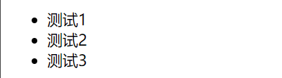
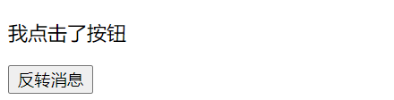
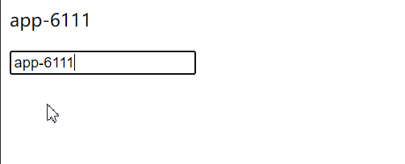

# day3


## 早上

1. 定位与布局
2. js

定位沿用昨天的代码,只改动css

```css
   <style type="text/css">   
        *{
            /*去除浏览器外内边距*/
            margin: 0;
            padding: 0;
        }
        .box1, .box3{
            width: 200px;
            height: 200px;
        }
        .box2, .box4{
            width: 100px;
            height: 100px;
        }
            /*
        定位 作用:布局
        1. 相对定位
            - 不会改变标签的原始状态
        2. 绝对定位
            - 设置定位以后,当父级元素有定位属性时候, 相对于父级元素
            - 设置定位以后,逐级往上找,跟异常一样,一直往上抛,直到有人处理他
            - 脱离原油文档流,后面的元素会向前自动移位
            - 当自己元素宽度大于父级元素时候,并不会错位
            - 同级元素互相不干扰
        3. 固定定位
            - 相对于body
        */
        .box1{
            position: relative;
            background-color: red;
            top: 20pxpx;
            left: 20px;
        }
        .box2{
            background-color: green;
            position: absolute;
            top: 0px;
            left: 10px;
        }
        .box3{
            background-color: yellow;
            /* position: relative; */
            position: absolute;
            top: 20px;
            left: 20px;
        }
        .box4{
            background-color: blue;
            position: fix;
            top: 0px;
            left: 500px;
        }
    </style>
```

主要讲定位怎么调整,以及他的特点


js分为三种

1. 内联 

   ```html
   <div onclick="javascript:;"></div>
   ```

2. 内部

   ```html
   <script></script>
   ```

3. 外部js

   ```html
   <script src=""></script>
   ```


Hello World

```javascript
<script type="text/javascript">
    console.log("Hello World");
    alert("Hello World");
    document.write("Hello World");
    document.write("<p>Hello World</p>");
</script>
```

变量

```javascript
    //变量 number string boolean null undefined object
    //var 可变, 这个跟python一样,不做记录
    var num = 10;
    var num1 = 11;
    var num2 = "10";
    var num3 = "1a";
    var num4 = "1.a";
    var num5 = "1.1";
    console.log(num+num1, typeof(num+num1));
    console.log(num+ num2, typeof(num+num2));
    console.log(num-num2, typeof(num-num2));
    console.log(num-num3, typeof(num-num3));
    console.log(num-num4, typeof(num-num4));
    console.log(num-num3 == num-num4)
```


函数学过了

```javascript
function sum(a, b){
	console.log(a+b);
}
setInterval(function(){}, 1000) //1秒执行一次
```

dom

```javascript
    // 属性查找标签
    console.log(document.getElementById("box"));
    console.log(document.getElementsByClassName("p"));
    // 选择器查找标签
    //通过选择器找到同一选择器下的第一个标签
    console.log(document.querySelector("div"));
    console.log(document.querySelector(".p"));
    console.log(document.querySelector("ul li"));
    //通过选择器找到所有标签, 值为标签数组
    console.log(document.querySelectorAll("ul li")[0]);
```


## 下午


DOM操作


```javascript
<script type="text/javascript">
    var div = document.querySelector("div");
    var p = document.querySelector("p");
    var span = document.querySelector("span");
    div.setAttribute("class", "box");
    div.setAttribute("style", "width: 100px;")
    p.setAttribute("id", "p1");
    span.setAttribute("style", "background-color: yellow;");
    span.setAttribute("style", "border: 1px;")
    //属性名获取
    console.log(div.getAttribute("style"));
    console.log(p.getAttribute("id"));
    //操作类型名
    console.log(div.className);
    console.log(div.id);
    //操作样式
    p.style.width = "100px";
    p.style.border = "1px solid black";
    p.style.paddingLeft = "10px";
    p.style.borderRadius = "25px";

    //操作内容
    //innerText只能获取文本, html能获取所有内容
    console.log(div.innerHTML);
    console.log(div.innerText);
    div.innerText="123<p>p标签</p>";//设置内容,无法设置标签
    div.innerHTML="123<p>p标签</p>";//设置内容,可以设置标签
</script>
```


类搜索引擎的椭圆


vue

mvc, mvp, mvvm

1. 学习一个框架需要的东西
   - 开发文档
   - 浏览器
   - 编程工具

2. 介绍vue框架开发工具
   - vue官方文档
   - npm官方文档
   - webpack官方文档
3. vue安装使用


vue不能用类去渲染, 因为类不唯一, 实际他会渲染出现的第一个class

渲染数据

```vue
<div id="app">
    {{Message}}
</div>
```

结合

```javascript
    var vm = new Vue({
        el : "#app",
        data : {
            Message: "Hello World"
        }
    });
```

el里填的为id选择器, data里填的为键值对, 对应内容为模板类似的

1. 双向绑定的vm数据对象可以映射到model中,model改变以后会影响vm数据
2. vm可以改变view中数据,view中的数据又会影响vm中的数据
3. 双向绑定的数据都是键值对 key:value


## 自学

jquery学习

```javascript
    $("#box").width("100px");
    $("#box").height("100px");
    $("#box").css({
        "width": "100px",
        "height": "100px",
        "background-color": "red"
    });
```

jquery跟dom那里操作属性不太一样, dom获取到元素后,用 元素.style.属性 设置css可以

而jquery直接用.css设置效果, 宽高可以直接.出来


v-for

1. 表格可以用v-for, 大量数据传入

```vue
<div id="app-4">
    <ul>
        <li v-for="todo in todos">
            {{ todo.text }}
        </li>
    </ul>
</div>
```

结合

```javascript
    var app4 = new Vue({
        el: '#app-4',
        data: {
            todos:[
                {text: '测试1'},
                {text: '测试2'},
                {text: '测试3'}
            ]
        }
    });
```

类似python的for in, todos为我们需要传入的数组, todo为每个数组内容




v-if

1. 可以用在状态之间的转换,比如未登录与登录状态

```vue
<div id="app-3">
    <p v-if="seen">现在你看到我</p>
</div>
```

结合

```javascript
    var app3 = new Vue({
        el: '#app-3',
        data: {
            seen: true
        }
    });
```

v-on:click

1. 按钮事件

```vue
<div id="app-5">
    <p>{{ message}}</p>
    <button v-on:click="reverseMessage">反转消息</button>
</div>
```

结合

```javascript
    var app5 = new Vue({
        el: '#app-5',
        data: {
            message: "app-5"
        },
        methods: {
            reverseMessage:function(){
                this.message = "我点击了按钮"
            }
        }
    });
```



v-model

```vue
<div id="app-6">
    <p>{{ message}}</p>
    <input v-model="message"/>
</div>
```

结合

```javascript
    var app6 = new Vue({
        el: '#app-6',
        data:{
            message: "app-6"
        },

    })
```




这个会同时更新, v-model=message, 然后他的内容就会随着message的内容更新


v-bind

```vue
<div id="app-2">
    <span v-bind:title="message">
        鼠标悬停几秒钟查看此处动态绑定的提示信息
    </span>
</div>
```

结合

```javascript
    var app2 = new Vue({
        el: '#app-2',
        data:{
            message: '页面加载于' + new Date().toLocaleString()
        }
    });
// app2.message="新消息";
```

这里如果修改了message,体现了数据的双向绑定

bind:title, 也就是说绑定title, 标题

1. v-for
2. v-if
3. v-model
4. v-bind
5. v-on:click

