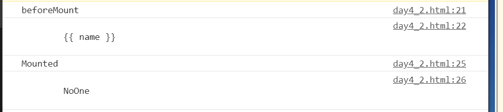

# day-4


## 早上


vue生命周期图


在创建vue实例对象时, 有两个阶段

1. 第一阶段是初始化时间绑定机制, 初始化生命周期的循环. 初始化之后会触发beforeCreate()回调函数
2. 第二个阶段是初始化注入器, 初始化尸体对象, 此时表示vue实例对象

- 已经创建成功, 初始化之后会触发created()回调函数

- beforeCreate() vue实例对象创建之前, 此时el属性和data属性均为空

-  created() vue实例对象创建之后, 此时el属性为空, data属性已经存在


```vue
    <div id="app">
        {{ name }}
    </div>
```

结合

```javascript
<script type="text/javascript">
    var vm = new Vue({
        el: '#app',
        data: {
            name: "NoOne"
        },
        beforeCreate:function(){
            console.log('beforeCreate');
            console.log(this.$el);
            console.log(this.$data);
        },
        created: function(){
            console.log('Created');
            console.log(this.$el);
            console.log(this.$data['name']);
        }
    })
</script>
```

这里可以看到效果


vue的Mount

在创建el属性之前, 回调函数为beforeMount

在创建el属性并与dom绑定后, 回调函数为mounted

```vue
    <div id="app">
        {{ name }}
    </div>
```

结合

```javascript

        var vm = new Vue({
            el: '#app',
            data: {
                name: "NoOne"
            },
            beforeMount: function(){
                console.log("beforeMount");
                console.log(this.$el.innerHTML);
            },
            mounted:function(){
                console.log("Mounted");
                console.log(this.$el.innerHTML);
            }
        })
```

效果




beforeUpdate updated

属性更新之前的回调以及更新之后的回调

beforeDestroy destroyed

销毁之前的回调以及销毁时的回调

```javascript
        var vm = new Vue({
            el: '#app',
            data: {
                name: "NoOne"
            },
            beforeMount: function(){
                console.log("beforeMount");
                console.log(this.$el.innerHTML);
            },
            mounted:function(){
                console.log("Mounted");
                console.log(this.$el.innerHTML);
            },updated:function(){
                console.log("update");
                console.log(this.$el.innerHTML);
            }
        });
        vm.name="test";

        //beforeUpdate updated
        // 属性更新之前的回调以及更新之后的回调

        //beforeDestroy destroyed
        // 销毁之前的回调以及销毁时的回调
```


模板语法

```vue
<body>
    <div id="app">
        {{ name }}
        <ul>
            <li>{{ user.name}}</li>
            <li>{{ user.desc}}</li>
        </ul>
        <ul>
            <li>{{ names[0] }}</li>
            <li>{{ names[1] }}</li>
            <li>{{ names[2] }}</li>
        </ul>
    </div>
</body>
<script src="./static/js/vue.js"></script>
<script type="text/javascript">
    //模板语法
    

    var data = {
        name: 'vue',
        user: {
            name: 'vue',
            desc: 'this is vue'
        },
        names: ['vue', 'react', 'angular']
    }
    var vm = new Vue({
        el: '#app',
        data: data
    })
</script>
```

可以有对象, 可以有数组,也可以有直接数据

v-html跟普通的区别

```vue
<body>
    <div id="app">
        <div>
            {{ html }}
        </div>
        <div v-html="html"></div>
    </div>
</body>
<script src="./static/js/vue.js"></script>
<script type="text/javascript">
    var data = {
        html: '<font color="red">这是红色字体</font>'
    }
    var vm = new Vue({
        el: '#app',
        data: data
    })
</script>
```

v-html可以渲染成网页,v-html有坑


这种不加括号,跟加括号结果不一样的, 带加号, 他的执行将后面那个加号转成字符串了


v-bind

```vue
<body>
    <div id="app">
        <div>
            <a v-bind:href="link.link">全写:{{link.name}}</a>
        </div>
        <div>
            <a :href="link.link">简写:{{ link.name }}</a>
        </div>
    </div>
</body>
<script src="./static/js/vue.js"></script>
<script type="text/javascript">
    //若动态属性flase,null, undefined 则该属性不存在
    var data = {
        link: {
            name: 'Vue框架开发',
            link: 'http://www.baidu.com'
        }
    }
    var vm = new Vue({
        el: '#app',
        data: data
    })
</script>
```

v-bind可省略

## 下午

vue表达式

```vue
<body>
    <div id="app">
        {{ 5 + 5 }}<br/>
        {{ok? 'YES': 'NO'}}<br/>
        {{ message.split('').reverse().join('')}}
        <div v-bind:id="'list-'+id"><!--字符串拼接-->
            NoOne_is_here
        </div>
    </div>
</body>
<script src="./static/js/vue.js"></script>
<script type="text/javascript">
    /*
    vue框架中提供了js表达式
    同样v-bind绑定中也可以进行一些运算
    同样对于所有数据绑定,vue都提供了完整的js表达式
    */

    var data = {
        ok: true,
        message: "NoOne",
        id: 1
    }
    var app = new Vue({
        el: '#app',
        data: data
    });
</script>
```

vue计算属性

```vue
<body>
    <div id="app">
        <p>订单金额: {{amount}}</p>
    </div>
</body>
<script src="./static/js/vue.js"></script>
<script type="text/javascript">
    /*
    1. 为什么使用计算属性
    设计初衷用于简单计算,但过多会让模板难以维护
    例计算用户订单金额
    订单金额 = {{ count * price* discount + freight}}
    
    为了解决过于复杂的计算, 我们引入了计算属性computed
    在使用时候先定义计算属性 将复杂的计算在计算属性中直接计算完成, 然后给视图使用就可以了

    */

    var data = {
        count: 5,
        price: 11.5,
        discount: 0.85,
        freight: 3.5
    }
    var vm = new Vue({
        el: '#app',
        data: {
            result: data['count'] * data['price']
        },
        computed:{
            amount: function(){
                return this.$data.count * this.$data.price * this.$data.discount + this.$data.freight;
            }
        }
    })
</script>
```

这里我本来想为什么这么麻烦, 传了json还传个computed, 后面问人

知道computed带缓存功能, 而普通的计算方式是每次刷新页面都会重新计算,也就是我上面的,


methods

```vue
<script src="./static/js/vue.js"></script>
<script type="text/javascript">
    var data = {
        count: 10,
        price: 12.5,
        discount: 0.75,
        freight: 30
    }
    var vm = new Vue({
        el: '#app',
        data: data,
        methods: {
            getAmount:function(){
                console.log("你好");
                return this.count * this.price*this.discount+ this.freight;
            }
        }
    })
</script>
```

computed只有依赖发生改变才会重新计算, 

methods每次都会重新计算


列表循环

```vue
<body>
    <div id="app">
        <ul>
            <li v-for="good in goodsList"> {{good.name }} === {{good.price }}</li>
        </ul>
        <ul>
            <!-- <li v-for="good in goodsList"> {{good.name }} === {{good.price }}</li> -->
            <li v-for="good in goodsList">
                <span> {{ good.name}} </span>
                <span style="color: red;"> {{ good.price}} </span>
            </li>
        </ul>
    </div>
</body>
<script src="./static/js/vue.js"></script>
<script type="text/javascript">
    /*
    列表元素,输出一组属性,用v-for
    */
    var data = {
        goodsList: [
            {name: 'iphone', price: '8888'},
            {name: 'mp3', price: '888'},
            {name: 'video', price: '88'}
        ]
    }
    var vm = new Vue({
        el: '#app',
        data: data
    })
</script>
```

当v-for渲染数组时,可以给出index参数, 表示渲染数组的元素下标信息从0开始

```vue
v-for="(item,index) in items"
```

v-for可以渲染对象, 渲染对象时候,遍历对象所有属性值

```
 v-for="(value,key,index) in good"
```


## 自学


computed还有get, set方法

```vue
    var data = {
        goodsList: [
            {name: 'iphone', price: '8888'},
            {name: 'mp3', price: '888'},
            {name: 'video', price: '88'}
        ]
    }
    var vm = new Vue({
        el: '#app',
        data: data,
        computed: {
            get: function(){
                return this.$data.goodsList
            },
            set: function(newValue){
                this.$data.goodsList = newValue
            }
        }
    })
```

v-on有缩写

```vue
<a @click="event">百度</a>
<a v-on:click="event">谷歌</a>
<a @[event]="event">测试</a>
```

v-bind有动态参数

