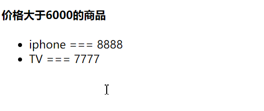
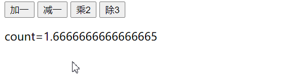
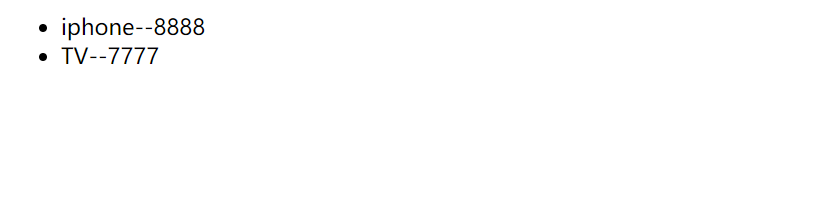
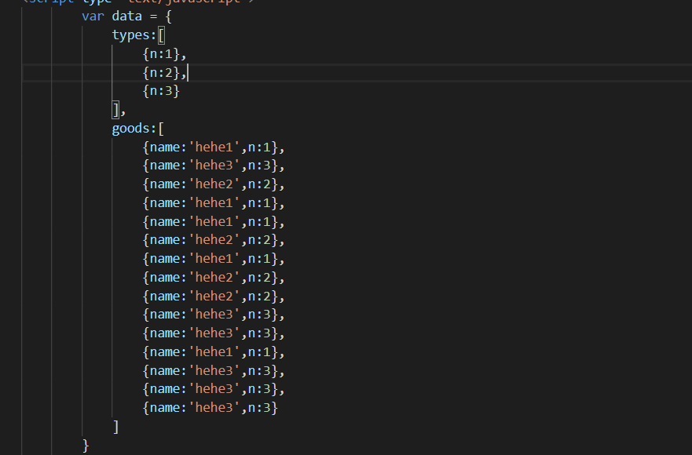
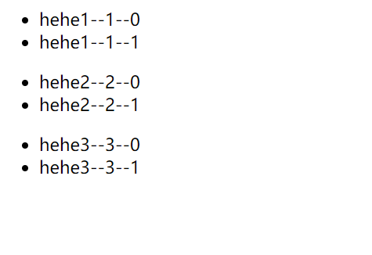
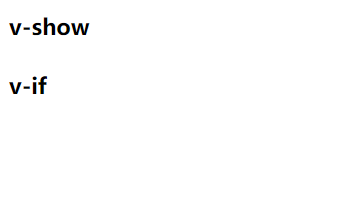

# day-5


## 早上

如何解决不能实时响应这件事情(用到了数组变异方法)

1. Vue.set(vm.goodsList, 0 , {name: 'mac', price:' 9999'})
2. vm.$set


push()在数组元素末尾添加, pop()末尾删除, 栈

unshift()数组元素开头添加 shift()开头删除 队列

a-b从小到大, b-a从大到小

sort(function(a, b))  数组按照所给条件排序vm.goodsList.sort(function(a,b){return a.price-b.price})

reverse() 数组数据翻转
splice 添加或者删除数组中多个元素

splice(2,1) 从下标为2开始,向后删除1个元素,包含下表为2的元素本身 vm.goodsList.splice(2,1)

splice(1,0,添加的内容) 从下标1开始,向后删除0个元素,然后添加新的内容 vm.goodsList.splice(1,1,{name:'MAC',price:'99999'})

若要添加多条内容 vm.goodsList.splice(1,1,{name:'MAC',price:'99999'},{name:'Airpord',price:'2000'})



事件处理需要绑定事件处理函数,在vue中绑定事件处理函数直接在HTML中使用v-on指令即可

语法格式v-on:'事件名',也可以写成@事件名,绑定事件处理函数

```vue
			<button v-on:click="count ++">加一</button>
			<button @click="count --">减一</button>
			
			<button @click="cheng()">乘2</button>
			<button v-on:click="chu()">除3</button>
			<p>count={{count}}</p>
```

可以直接写数进行加减,也可以写函数,返回



v-if指针

```vue
<body>
    <div id="app">
        <h4>判断是否处于登录状态</h4>
        <div v-if="isLogin==true">
            欢迎登录
            <p v-if="type=='A'">A级用户</p>
            <p v-else-if="type=='B'">B级用户</p>
            <p v-else-if="type=='C'">C级用户</p>
            <p v-else>D级用户</p>
        </div>
        <div v-else>
            <a href="#">请登录</a>
        </div>
    </div>
</body>
<script src="./static/js/vue.js"></script>
<script type="text/javascript">
		var vm = new Vue({
			el:'#app',
			data:{
				isLogin:true,
				type:'A'
			}
		})
</script>
```

这里做登录状态的绑定, 这里isLogin的==可以省略,直接为true也可以, 只要v-if结果不为0即可, 编程语言思想是通用的


v-if与v-for

```vue
<body>
    <div id="app">
        <ul>
            <li v-for="good in goodsList" v-if="good.price>6000">{{good.name}}--{{good.price}}</li>
        </ul>
    </div>
</body>
<script src="./static/js/vue.js"></script>
<script type="text/javascript">
    var data = {
        goodsList: [
            { name: 'iphone', price: '8888' },
            { name: 'mp3', price: '888' },
            { name: 'video', price: '88' },
            { name: 'TV', price: '7777' }
        ]
    }

    var vm = new Vue({
        el: '#app',
        data: data
    })
</script>
```

结合起来, 可以直接取到, 商品价格大于6000的




```vue
        <ul v-for="type in types">
            <!-- 每一个type对应自己的商品数组 -->
            <li v-for="(good,index) in filterGoods(goods,type)" v-if="index < 2">{{good.name}}--{{good.n}}--{{index}}</li>
        </ul>


```

结合

```javascript
		var vm = new Vue({
			el:"#app",
			data:data,
			methods:{
				filterGoods:function(goods,type){
					return goods.filter(function(good){
						return good.n == type.n;
					})
				}
			}
		})
```

数据格式



这样可以取出n < 2的




## 下午

当v-for v-if作用于同一个标签时,v-for的优先级就比v-if更高

如何让v-if的优先级高于v-for,v-if写在父标签上

这是个小技巧

```vue
    <div id="app">
        <ul v-if="types.n == 1">
            <li v-for="good in goods" v-if="good.n == types.n">{{good}}</li>
        </ul>
    </div>
```

v-show指令 根据条件的不同，决定是否显示渲染元素

v-if和v-show的区别,v-if是决定是否渲染元素(当不渲染该元素时,该元素是不存在的)

v-show决定是否显示渲染元素(这个元素是存在的,只不过是修改了display的值)

```vue
		<div id="app">
			<h4>v-show</h4>
			<p v-show="isLogin == true">v-show内容</p>
			<h4>v-if</h4>
			<p v-if="isLogin">v-if内容</p>
		</div>
```



