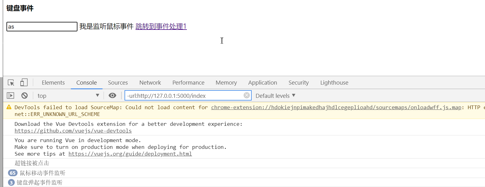
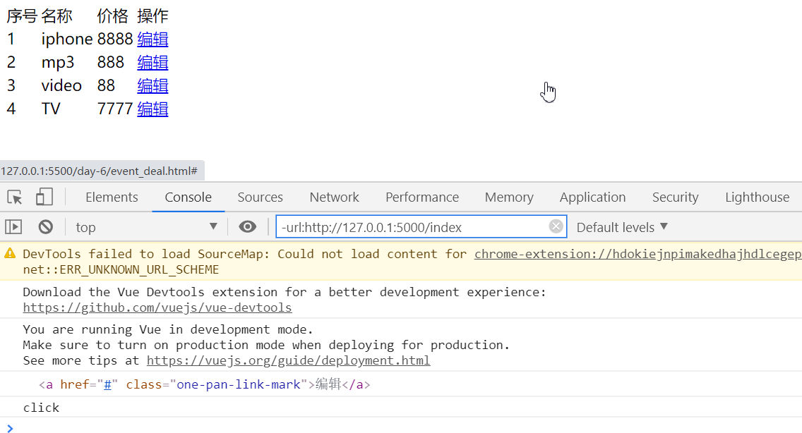
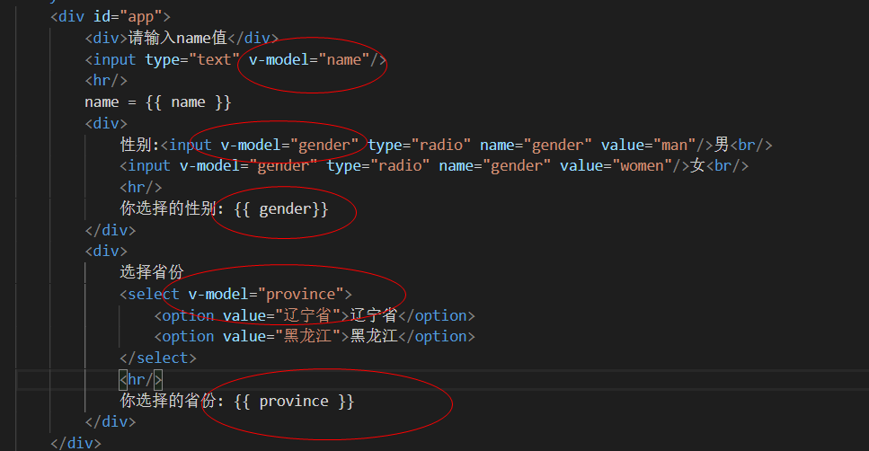
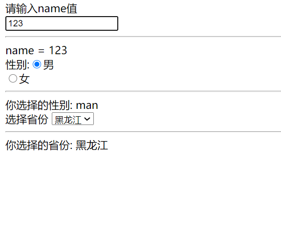
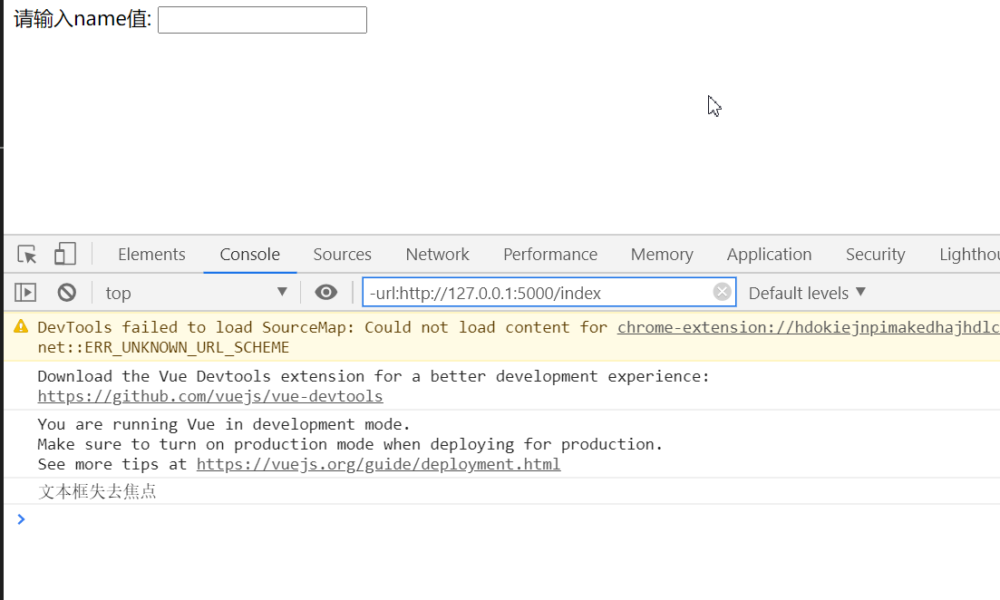
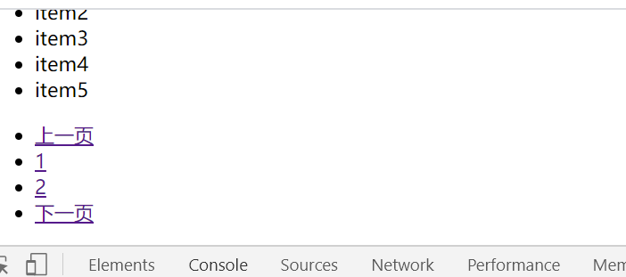
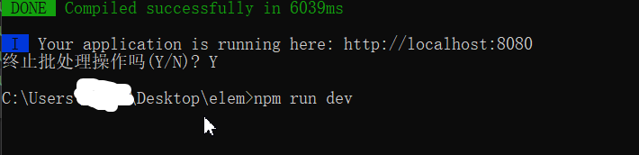

# day-6


##  早上

鼠标事件,键盘事件

鼠标事件: click单击 dbclick双击, mouseover鼠标经过, mouseout鼠标离去

键盘: keydown键盘按下 keyup键盘抬起

事件修饰符 主要指我们在vue事件处理过程中,可以试用它来阻止默认行为,阻止事件冒泡

或者获取键盘修饰等基本功能, 使用方式很简单, 在v-on指令后用点号连接事件

修饰符: stop阻止事件冒泡, prevent阻止事件默认行为,capture捕获内部元素

once只执行一次


```vue
    <div id="app">
        <h4>键盘事件</h4>
        <input type="text" @keyup="keyupevent"/>
        <a @mousemove="mousemoveevent">我是监听鼠标事件</a>
        <a href="event_deal.html" @click.prevent="aclick">跳转到事件处理1</a>
    </div>
    
    <script type="text/javascript">
   var vm = new Vue({
       el: '#app',
       methods:{
           keyupevent:function(){
               console.log("键盘弹起事件监听");
           },
           mousemoveevent: function(){
               console.log("鼠标移动事件监听");
           },
           aclick: function(){
               console.log("超链接被点击");
           }
       }
   });
</script>
```




事件处理事件对象,即在事件处理过程中会自动触发一个event事件对象

从而可以做某些事情


event.type事件类型

event.target 触发事件的html元素

event.preventDeafult 阻止事件默认行为

envet.stopPropagation 阻止冒泡行为

在Vue使用事件对象分两步

1. 传递事件对象 当v-on绑定处理函数时候, 手动传递事件对象$event,当传递多个参数时$event永远在最后,代表当前对象

2. 接受事件对象, 在methods方法中定义函数位置,通过形参接受事件对象

```vue
    <div id="app">
        <table>
            <tr>
                <td>序号</td>
                <td>名称</td>
                <td>价格</td>
                <td>操作</td>
            </tr>
            <tr v-for="(good, index) in goodsList">
                <td> {{ index+1}} </td>
                <td> {{ good.name}} </td>
                <td> {{ good.price}} </td>
                <td> <a href="#" @click.prevent="editItem($event)">编辑</a></td>
            </tr>
        </table>
    </div>
```

结合

```vue
<script type="text/javascript">
   var vm = new Vue({
       el: '#app',
       data : {
        goodsList: [
            {name: 'iphone', price: '8888'},
            {name: 'mp3', price: '888'},
            {name: 'video', price: '88'},
            {name: 'TV', price: '7777'}
        ]
        },
        methods: {
            editItem:function(event){
                console.log(event.target);
                console.log(event.type);
            }
        }
   });
</script>
```



借助事件对象实现一个事件委派机制, 从而提高应用程序性能

什么是事件委派机制? 事件委派在列表渲染过程中,大部分是在v-for指令中, 借助event事件对象在父级元素中绑定事件处理函数

借助event事件对象, 在父级元素中绑定事件处理函数,而不是在子元素上绑定事件处理函数

```vue
    <div id="app">
        <table @click.prevent="editItem($event)">
            <tr>
                <td>序号</td>
                <td>名称</td>
                <td>价格</td>
                <td>操作</td>
            </tr>
            <tr v-for="(good, index) in goodsList">
                <td> {{ index+1}} </td>
                <td> {{ good.name}} </td>
                <td> {{ good.price}} </td>
                <td> <a href="#" v-bind:data-index="index">编辑</a></td>
            </tr>
        </table>
    </div>
    
    
```

结合

```vue
<script type="text/javascript">
    var vm = new Vue({
       el: '#app',
       data : {
        goodsList: [
            {name: 'iphone', price: '8888'},
            {name: 'mp3', price: '888'},
            {name: 'video', price: '88'},
            {name: 'TV', price: '7777'}
        ]
        },
        methods: {
            editItem:function(event){
                console.log("click");
                
                if(event.target.nodeName.toLowerCase() == 'a'){
                    console.log(event.target.nodeName.toLowerCase() == 'a');
                }
            }
        }
   });
</script>
```

这样可以从大事件里判断小事件, 点击a标签事件

表单处理主要分为两部分内容:

1. 表单输入绑定,表单输入数据如何与vue框架中的data数据双向绑定

2. 内容是表单事件处理

在Vue中实现单双向绑定, 直接使用v-model指令进行关联

v-model会根据空间类型自动选取正确的方法来更新元素

数据的双向绑定






## 下午

表单事件处理就是当表单元素发生变化时会触发响应事件,可以为表单元素绑定事件处理函数.常用的表单事件处理函数如下:

| 事件   | 触发控件        | 说明                                 |
| ------ | --------------- | ------------------------------------ |
| focus  | text文本框      | 文本框获取光标焦点                   |
| blur   | text文本框      | 文本框失去光标焦点                   |
| click  | 单选按钮,复选框 | 选中                                 |
| change | 下拉列表        | 切换下拉列表选项                     |
| submit | 提交按钮        | 单击提交按钮(<input type="submit/>") |

```vue
<script type="text/javascript">
    var vm = new Vue({
        el: '#app',
        data: {
            name:''
        },
        methods: {
            handBlur: function(){
                console.log("文本框失去焦点");
            }
        }
    })
</script>
```




用所学知识实现一个todolist,主要功能实现分页显示数据

在todolist结构中可以添加一个新项目,实现分页查看,查看上一页和下一页

```vue
    <div id="app">
        <div>
            todo-list
            <div>
                添加新项目<input type="text" v-model="item.name" @keyup.enter="addItem"/>
            </div>
            <div>
                <ul>
                    <li v-for="(item, index) in pageItems">
                        {{ item.name }}
                    </li>
                </ul>
            </div>
            <div>
                <ul>
                    <li><a href="#" @click.prevent="lastpage">上一页</a></li>
                    <li v-for="p in pagecount">
                        <a href="#" @click.prevent="jmpPage(p)">{{p}}</a>
                    </li>
                    <li><a href="#" @click.prevent="nextpage">下一页</a></li>
                </ul>
            </div>
        </div>
    </div>
```




安装vue-cli



