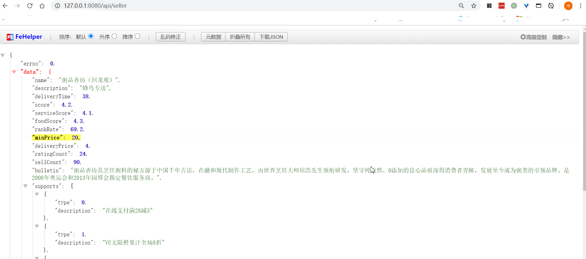
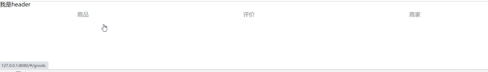
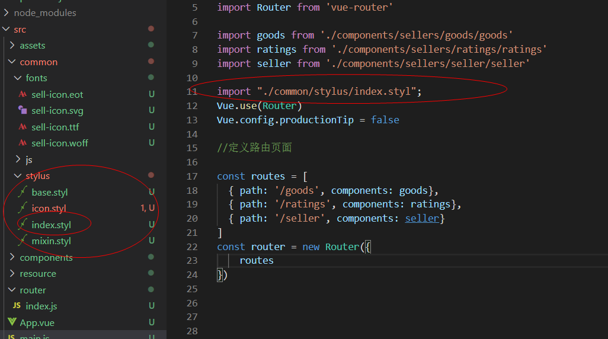

# day-7


## 早上


webpack.dev.conf.js写

```javascript
const express = require('express')
const app = express();
var appData = require('../data.json')
var seller = appData.seller
var goods = appData.goods
var ratings = appData.ratings

var apiRoutes = express.Router();
app.use('/api', apiRoutes) 
devServer: {
    before(app){
        app.get('/api/seller', (req,res)=>{
          res.json({
            errno: 0,
            data: seller
          })
        }),
        app.get('/api/goods', (req,res)=>{
          res.json({
            errno: 0,
            data: seller
          })
        }),
        app.get('/api/ratings', (req,res)=>{
          res.json({
            errno: 0,
            data: seller
          })
        })
    },
        
```




组件化

```vue
<script>
  import header from './components/seller/header/header.vue'
  export default{
    components:{
      'v-header':header
    }
  }
</script>
```

App.vue导入header组件

路由, 组件




## 下午

这个配置有点复杂, 整理下吧

1. 导入common模块

   - font
     - sell-icon.eot
     - sell-icon.svg
     - sell-icon.ttf
     - sell-icon.woff
   - js
   - stylus
     - icon.styl(这里删除所有的'{ ', '}', ';')

2. 导入css, static->reset.css

   - ```shell
     npm install stylus stylus-loader --save-dev
     ```

3. webpack.dev.conf.js编写,在HOST,PORT下填早上的代码

4. 导入components模块

   - sellers
     - goods
       - goods.vue
     - headers
       - header.vue
     - ratings
       - ratings.vue
     - seller
       - seller.vue

   每个模块导入类似代码,替换成相应页面名称

   ```vue
   <template>
       <div class="goods">
           我是goods
       </div>
   </template>
   
   <script>
   export default {
       
   }
   </script>
   <style>
   
   </style>
   ```

   

5. 导入resource模块

6. 填写App.vue

   ```vue
   <template>
     <div id="app">
       <v-header></v-header>
       <div class="tab">
           <div class="tab-item">
               <router-link to="/goods">商品</router-link>
           </div>
           <div class="tab-item">
               <router-link to="/ratings">评价</router-link>
           </div>
           <div class="tab-item">
               <router-link to="/seller">商家</router-link>
           </div>
       </div>
       <router-view></router-view>
     </div>
   </template>
   
   <script>
     import header from './components/sellers/header/header.vue'
     export default{
       components:{
         'v-header':header
       }
     }
   </script>
   
   <style lang="stylus" rel="stylesheet/stylus">
     #app
         .tab
             display: flex
             width: 100%
             height: 40px
             line-height: 40px
             .tab-item
                 flex: 1
                 text-align: center
   </style>
   ```





