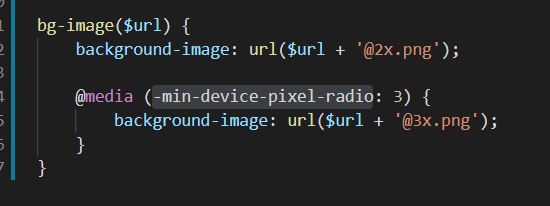
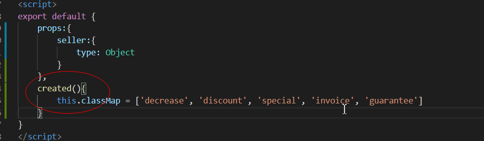

# day-8

今日一坑, component写成components了,然后点击tab栏没反应

这样可以默认选中

学习了

选择移动端视图

挺好看的感觉

## 自学

stylus的语法可以传函数一样的,类似这种

模块化思想:

每个地方所用的图片都放到其对应模块下,比如header里放header里引用的图片

最主要还是css的编写,这里是stylus编写

头像以及数据传法

利用created创建classMap